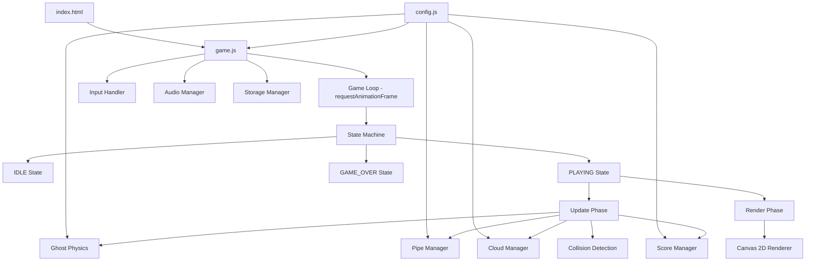
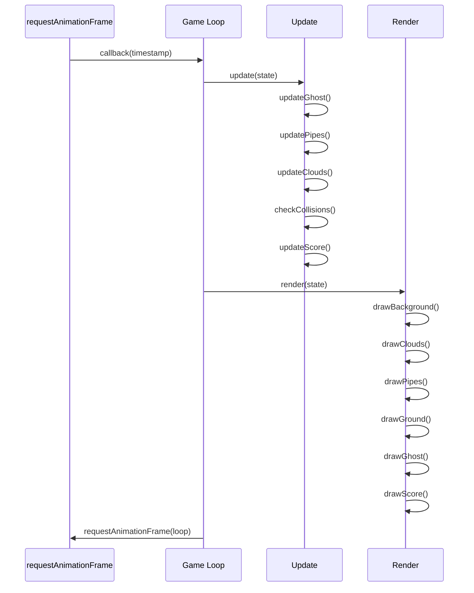
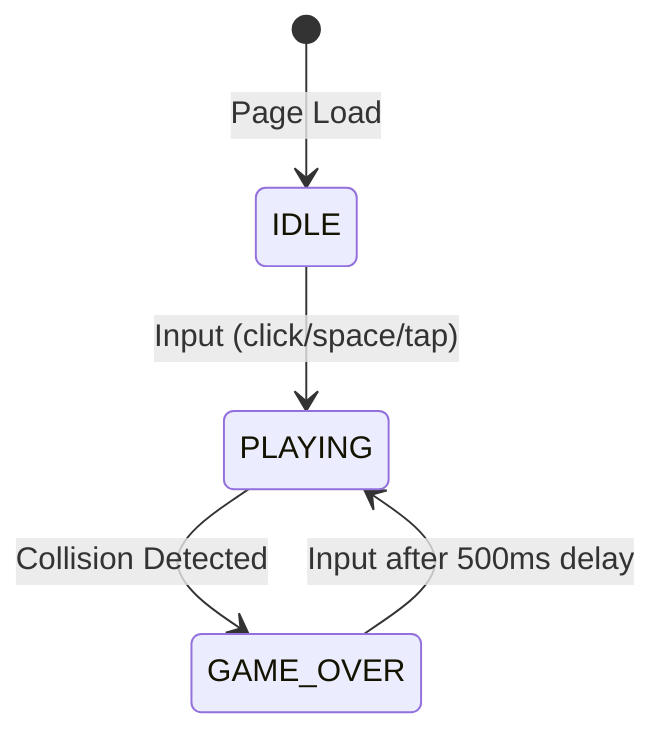

# Design Document

## Overview

Flappy Kiro is a browser-based retro endless side-scroller game implemented as a single-page HTML5 Canvas application. The game uses vanilla JavaScript with no external dependencies, leveraging the Canvas 2D API for rendering, the Web Audio API for sound effects, and `localStorage` for score persistence. The architecture follows a classic game loop pattern with distinct update and render phases running at approximately 60 FPS via `requestAnimationFrame`.

### Key Design Decisions

- **Vanilla JS, no framework**: The game is simple enough that a framework adds unnecessary overhead. A single `index.html` file with embedded or linked JS keeps deployment trivial.
- **Centralized configuration module**: All tunable game constants live in a single `config.js` module exporting a nested `CONFIG` object. Other modules import from `config.js` rather than hardcoding magic numbers. This enables fast iteration on game feel (gravity, speeds, gap sizes) without touching game logic.
- **Fixed logical resolution with CSS scaling**: All game physics operate on an 800×600 pixel coordinate space. The canvas is scaled via CSS `object-fit` to fill the viewport while preserving aspect ratio. This decouples physics from display size.
- **State machine for game flow**: A simple state machine (`IDLE`, `PLAYING`, `GAME_OVER`) governs input handling and update logic, keeping transitions clean and testable.
- **Entity-component approach (lightweight)**: Game objects (Ghost, Pipes, Clouds) are plain objects with position/velocity properties updated each frame. No class hierarchy needed for this scope.

## Architecture



### Game Loop Flow



## Components and Interfaces

### 0. Configuration Module (`config.js`)

A centralized module that exports all tunable game constants as a single `CONFIG` object with nested groups. All other modules import values from `config.js` instead of defining their own magic numbers. This single source of truth enables fast iteration on game feel — adjusting gravity, pipe gaps, speeds, or scoring keys — without touching any game logic.

```javascript
export const CONFIG = {
  canvas: { width: 800, height: 600, groundHeightPercent: 0.10 },
  ghost: { gravity: 0.5, flapVelocity: -8, maxFallSpeed: 12, minRotation: -30, maxRotation: 90 },
  pipes: { speed: 3, spacing: 300, gapHeight: 150, gapMinPercent: 0.2, gapMaxPercent: 0.8, capOverhangPercent: 0.1 },
  clouds: { minSpeed: 0.5, maxSpeed: 1.5, minOpacity: 0.3, maxOpacity: 0.7 },
  scoring: { storageKey: 'flappyKiro_highScore' },
  timing: { restartDelay: 500 },
};
```

**Design rationale:**
- Nested groups (`canvas`, `ghost`, `pipes`, `clouds`, `scoring`, `timing`) make it easy to locate related constants and understand their scope.
- A single import (`import { CONFIG } from './config.js'`) gives any module access to any constant without cross-module coupling.
- Changing a value in `config.js` propagates everywhere immediately — useful for playtesting tweaks.
- The object is frozen at runtime (`Object.freeze`) in production to catch accidental mutations during development.

**Usage pattern in consuming modules:**

```javascript
import { CONFIG } from './config.js';

// Ghost module
function updateGhost(ghost) {
  ghost.velocity = Math.min(ghost.velocity + CONFIG.ghost.gravity, CONFIG.ghost.maxFallSpeed);
  ghost.y += ghost.velocity;
  return ghost;
}

// Pipe module
function shouldSpawnPipe(pipes, canvasWidth) {
  if (pipes.length === 0) return true;
  const last = pipes[pipes.length - 1];
  return last.x <= canvasWidth - CONFIG.pipes.spacing;
}
```

### 1. Game Controller (`game.js`)

The main entry point that initializes the canvas, loads assets, and starts the game loop.

```typescript
// Type definitions for documentation purposes (implementation in plain JS)

interface GameState {
  status: 'IDLE' | 'PLAYING' | 'GAME_OVER';
  ghost: Ghost;
  pipes: Pipe[];
  clouds: Cloud[];
  score: number;
  highScore: number;
  gameOverTimestamp: number | null;
}

function init(): void;
function gameLoop(timestamp: number): void;
function update(): void;
function render(): void;
function handleInput(): void;
function resetGame(): void;
```

### 2. Ghost Module

Manages the player character's physics and rendering. All physics constants are imported from `CONFIG.ghost`.

```typescript
interface Ghost {
  x: number;          // Fixed horizontal position (left third of screen)
  y: number;          // Vertical position
  velocity: number;   // Current vertical velocity (positive = down)
  width: number;      // Sprite width
  height: number;     // Sprite height
  rotation: number;   // Current rotation in degrees
}

// Constants sourced from CONFIG.ghost:
// gravity, flapVelocity, maxFallSpeed, minRotation, maxRotation

function createGhost(): Ghost;
function updateGhost(ghost: Ghost): Ghost;
function flapGhost(ghost: Ghost): Ghost;
function getGhostBounds(ghost: Ghost): BoundingBox;
```

### 3. Pipe Manager

Handles pipe pair generation, scrolling, and removal. All pipe constants are imported from `CONFIG.pipes`.

```typescript
interface Pipe {
  x: number;           // Horizontal position
  gapCenterY: number;  // Center of the gap (vertical)
  gapHeight: number;   // Fixed at 150px
  width: number;       // Pipe body width
  capWidth: number;    // Cap extends beyond body (≥10% each side)
  capHeight: number;   // Cap height
  scored: boolean;     // Whether this pipe has been scored
}

// Constants sourced from CONFIG.pipes:
// speed, spacing, gapHeight, gapMinPercent, gapMaxPercent, capOverhangPercent

function createPipe(x: number, playableHeight: number): Pipe;
function updatePipes(pipes: Pipe[]): Pipe[];
function shouldSpawnPipe(pipes: Pipe[], canvasWidth: number): boolean;
function getTopPipeBounds(pipe: Pipe): BoundingBox;
function getBottomPipeBounds(pipe: Pipe, playableHeight: number): BoundingBox;
```

### 4. Cloud Manager

Manages decorative background clouds with parallax scrolling. Speed and opacity ranges are imported from `CONFIG.clouds`.

```typescript
interface Cloud {
  x: number;
  y: number;
  width: number;
  height: number;
  speed: number;       // Between CONFIG.clouds.minSpeed and CONFIG.clouds.maxSpeed
  opacity: number;     // Between CONFIG.clouds.minOpacity and CONFIG.clouds.maxOpacity
}

// Constants sourced from CONFIG.clouds:
// minSpeed, maxSpeed, minOpacity, maxOpacity

function createCloud(canvasWidth: number, canvasHeight: number): Cloud;
function updateClouds(clouds: Cloud[], canvasWidth: number): Cloud[];
```

### 5. Collision Detection

Axis-aligned bounding box (AABB) collision checks.

```typescript
interface BoundingBox {
  x: number;
  y: number;
  width: number;
  height: number;
}

function checkAABBCollision(a: BoundingBox, b: BoundingBox): boolean;
function checkGhostCollisions(ghost: Ghost, pipes: Pipe[], groundY: number, canvasHeight: number): boolean;
```

### 6. Score Manager

Tracks current score, high score, and persistence.

```typescript
function checkScoreUpdate(ghost: Ghost, pipes: Pipe[]): number;
function loadHighScore(): number;
function saveHighScore(score: number): void;
```

### 7. Audio Manager

Handles sound effect loading and playback.

```typescript
interface AudioManager {
  jumpSound: HTMLAudioElement | null;
  gameOverSound: HTMLAudioElement | null;
}

function createAudioManager(): AudioManager;
function playJump(audio: AudioManager): void;
function playGameOver(audio: AudioManager): void;
function stopAll(audio: AudioManager): void;
```

### 8. Input Handler

Unified input handling for mouse, keyboard, and touch.

```typescript
function setupInputHandler(canvas: HTMLCanvasElement, onInput: () => void): void;
```

### 9. Renderer

Canvas 2D rendering in correct layer order.

```typescript
function renderBackground(ctx: CanvasRenderingContext2D): void;
function renderClouds(ctx: CanvasRenderingContext2D, clouds: Cloud[]): void;
function renderPipes(ctx: CanvasRenderingContext2D, pipes: Pipe[], groundY: number): void;
function renderGround(ctx: CanvasRenderingContext2D, groundY: number): void;
function renderGhost(ctx: CanvasRenderingContext2D, ghost: Ghost, sprite: HTMLImageElement): void;
function renderScore(ctx: CanvasRenderingContext2D, score: number, highScore: number): void;
function renderGameOver(ctx: CanvasRenderingContext2D, score: number): void;
```

## Data Models

### Game Constants

All constants below are defined in and exported from `config.js` as properties of the `CONFIG` object. No module should hardcode these values — they must import from `config.js`.

| Constant | Value | CONFIG Path | Requirement |
|----------|-------|-------------|-------------|
| `CANVAS_WIDTH` | 800 | `CONFIG.canvas.width` | Requirement 9.1 |
| `CANVAS_HEIGHT` | 600 | `CONFIG.canvas.height` | Requirement 9.1 |
| `GROUND_HEIGHT_PERCENT` | 0.10 | `CONFIG.canvas.groundHeightPercent` | Requirement 7.3 |
| `GRAVITY` | 0.5 px/frame² | `CONFIG.ghost.gravity` | Requirement 2.1 |
| `FLAP_VELOCITY` | -8 px/frame | `CONFIG.ghost.flapVelocity` | Requirement 2.2 |
| `MAX_FALL_SPEED` | 12 px/frame | `CONFIG.ghost.maxFallSpeed` | Requirement 2.4 |
| `MIN_ROTATION` | -30° | `CONFIG.ghost.minRotation` | Requirement 2.5 |
| `MAX_ROTATION` | 90° | `CONFIG.ghost.maxRotation` | Requirement 2.5 |
| `PIPE_SPEED` | 3 px/frame | `CONFIG.pipes.speed` | Requirement 3.2 |
| `PIPE_SPACING` | 300 px | `CONFIG.pipes.spacing` | Requirement 3.1 |
| `GAP_HEIGHT` | 150 px | `CONFIG.pipes.gapHeight` | Requirement 3.4 |
| `GAP_MIN_PERCENT` | 0.2 | `CONFIG.pipes.gapMinPercent` | Requirement 3.3 |
| `GAP_MAX_PERCENT` | 0.8 | `CONFIG.pipes.gapMaxPercent` | Requirement 3.3 |
| `CAP_OVERHANG_PERCENT` | 0.1 | `CONFIG.pipes.capOverhangPercent` | Requirement 7.4 |
| `CLOUD_MIN_SPEED` | 0.5 px/frame | `CONFIG.clouds.minSpeed` | Requirement 7.2 |
| `CLOUD_MAX_SPEED` | 1.5 px/frame | `CONFIG.clouds.maxSpeed` | Requirement 7.2 |
| `CLOUD_MIN_OPACITY` | 0.3 | `CONFIG.clouds.minOpacity` | Requirement 7.2 |
| `CLOUD_MAX_OPACITY` | 0.7 | `CONFIG.clouds.maxOpacity` | Requirement 7.2 |
| `STORAGE_KEY` | `'flappyKiro_highScore'` | `CONFIG.scoring.storageKey` | Requirement 5.4 |
| `RESTART_DELAY` | 500 ms | `CONFIG.timing.restartDelay` | Requirement 6.5 |

### State Transitions



### Local Storage Schema

| Key | Type | Description |
|-----|------|-------------|
| `flappyKiro_highScore` | string (numeric) | Persisted high score value |

Validation: On read, parse as integer. If `NaN`, negative, or missing, default to `0`.

### Asset Manifest

| Asset | Path | Usage |
|-------|------|-------|
| Ghost sprite | `assets/ghosty.png` | Player character rendering |
| Jump sound | `assets/jump.wav` | Flap input feedback |
| Game over sound | `assets/game_over.wav` | Collision feedback |


## Correctness Properties

*A property is a characteristic or behavior that should hold true across all valid executions of a system—essentially, a formal statement about what the system should do. Properties serve as the bridge between human-readable specifications and machine-verifiable correctness guarantees.*

### Property 1: Ghost velocity update applies gravity with terminal velocity

*For any* ghost with vertical velocity `v`, after one physics update frame, the resulting velocity should equal `min(v + 0.5, 12)` — gravity is applied then clamped to the maximum fall speed.

**Validates: Requirements 2.1, 2.4**

### Property 2: Flap replaces current velocity

*For any* ghost with any vertical velocity, after a flap action, the ghost's velocity should be exactly -8 regardless of the previous velocity value.

**Validates: Requirements 2.2**

### Property 3: Ghost rotation stays within bounds

*For any* ghost velocity value, the computed rotation should always be within the range [-30, 90] degrees.

**Validates: Requirements 2.5**

### Property 4: Pipe creation invariants

*For any* pipe created by the pipe factory given a playable area height, the gap center Y should be between 20% and 80% of the playable height, AND the gap height should be exactly 150 pixels, AND the cap width should be at least 120% of the pipe body width.

**Validates: Requirements 3.3, 3.4, 7.4**

### Property 5: Pipe scrolling is constant speed

*For any* pipe at position `x`, after one update frame, the pipe's x position should equal `x - 3`.

**Validates: Requirements 3.2**

### Property 6: Off-screen pipes are removed

*For any* array of pipes after an update, no pipe should remain in the array if its right edge (x + width) is less than zero.

**Validates: Requirements 3.5**

### Property 7: AABB collision detection correctness

*For any* two bounding boxes A and B, `checkAABBCollision(A, B)` returns true if and only if A and B overlap on both axes (A.x < B.x + B.width AND A.x + A.width > B.x AND A.y < B.y + B.height AND A.y + A.height > B.y).

**Validates: Requirements 4.2, 4.5**

### Property 8: Boundary collision detection

*For any* ghost position, a ground collision is detected if and only if `ghost.y + ghost.height >= groundY`, and a ceiling collision is detected if and only if `ghost.y <= 0`.

**Validates: Requirements 4.3, 4.4**

### Property 9: Score increments exactly once per pipe

*For any* pipe pair where `pipe.scored === false` and the ghost's x position passes `pipe.x + pipe.width / 2`, the score should increment by exactly 1 and the pipe should be marked as scored. Subsequent frames with the ghost still past the midpoint should not increment the score again.

**Validates: Requirements 5.1**

### Property 10: High score is monotonically non-decreasing

*For any* current score and high score, after a score update, the resulting high score should equal `max(currentScore, previousHighScore)`.

**Validates: Requirements 5.3**

### Property 11: Score display format

*For any* non-negative integers `score` and `highScore`, the formatted score string should be exactly `"Score: {score} | High: {highScore}"`.

**Validates: Requirements 1.3, 5.2**

### Property 12: High score localStorage validation

*For any* value retrieved from localStorage that is not a string representing a valid non-negative integer (including null, undefined, negative numbers, floats, non-numeric strings, and empty string), `loadHighScore()` should return 0.

**Validates: Requirements 1.4, 5.5**

### Property 13: Cloud speed invariant

*For any* cloud created by the cloud factory, its speed should be within the range [0.5, 1.5] pixels per frame inclusive.

**Validates: Requirements 7.2**

### Property 14: Restart delay guard

*For any* timestamp within 500 milliseconds after entering Game_Over_State, player input should be ignored and the game should remain in Game_Over_State.

**Validates: Requirements 6.5**

### Property 15: Canvas scaling preserves aspect ratio

*For any* viewport dimensions (width, height), the computed canvas display size should maintain a 4:3 aspect ratio (800:600) and fit entirely within the viewport without exceeding either dimension.

**Validates: Requirements 9.2**

## Error Handling

### Audio Failures

- **Loading failure**: If `HTMLAudioElement` fails to load (`onerror` event), set the audio reference to `null`. All playback functions check for `null` before calling `play()`.
- **Playback failure**: Wrap `play()` calls in try-catch. On failure, log to console and continue — audio is non-essential.
- **Browser autoplay policy**: First user interaction triggers audio context resume. Audio may be silent until first click/tap.

### LocalStorage Failures

- **Unavailable**: Wrap `getItem`/`setItem` in try-catch. If `localStorage` throws (private browsing, quota exceeded), default high score to 0 and skip persistence.
- **Corrupt data**: `parseInt()` with validation — if result is `NaN` or negative, use 0.
- **Key collision**: Use namespaced key `flappyKiro_highScore` to avoid conflicts.

### Asset Loading

- **Image load failure**: If `ghosty.png` fails to load, render a fallback colored rectangle at ghost dimensions. Game remains playable.
- **Loading timeout**: Set a 5-second timeout on asset loading. If exceeded, start with fallback rendering.

### Browser Compatibility

- **Canvas not supported**: Check for `canvas.getContext('2d')` support. Display a "Browser not supported" message if unavailable.
- **requestAnimationFrame**: Use the standard API (supported in all modern browsers). No polyfill needed for the target audience.

### Edge Cases

- **Tab backgrounding**: When the tab is hidden, `requestAnimationFrame` pauses. On return, use delta-time clamping to prevent a large physics "jump" — cap the effective delta to one frame's worth.
- **Extremely fast/slow devices**: The game uses per-frame physics (not delta-time). On devices significantly above/below 60 FPS, game speed varies. This is acceptable for a retro game and matches the requirements specification.

## Testing Strategy

### Unit Tests (Example-Based)

Unit tests verify specific scenarios, initial states, and integration points:

- **Game initialization**: Canvas dimensions set to 800×600, ghost at correct start position, score displays correctly
- **State transitions**: IDLE → PLAYING on input, PLAYING → GAME_OVER on collision, GAME_OVER → PLAYING after delay
- **Audio integration**: Sounds play on correct events, restart resets audio, failures don't crash
- **Render order**: Draw calls execute in correct layer order
- **Restart behavior**: All state resets correctly (score, position, pipes cleared)

### Property-Based Tests

Property-based tests verify universal correctness properties across randomized inputs. Use **fast-check** as the PBT library for JavaScript.

**Configuration:**
- Minimum 100 iterations per property test
- Each test tagged with: `Feature: flappy-kiro, Property {N}: {title}`

**Properties to implement:**

| # | Property | Key Generators |
|---|----------|---------------|
| 1 | Ghost velocity update | Random float velocity in [-20, 20] |
| 2 | Flap replaces velocity | Random float velocity in [-20, 20] |
| 3 | Ghost rotation bounds | Random float velocity in [-50, 50] |
| 4 | Pipe creation invariants | Random playable height in [200, 800] |
| 5 | Pipe scrolling speed | Random float x in [-1000, 2000] |
| 6 | Off-screen pipe removal | Array of pipes with random x in [-200, 1000] |
| 7 | AABB collision | Two random bounding boxes with x,y in [-100, 900], w,h in [1, 200] |
| 8 | Boundary collision | Random ghost y in [-100, 700], random height in [10, 80] |
| 9 | Score increment once | Random ghost.x, pipe.x, pipe.width, pipe.scored |
| 10 | High score monotonic | Random score and highScore in [0, 999999] |
| 11 | Score format | Random non-negative integers |
| 12 | localStorage validation | Random strings, numbers, null, undefined, negatives |
| 13 | Cloud speed range | Multiple cloud creations |
| 14 | Restart delay guard | Random timestamps within and beyond 500ms window |
| 15 | Canvas scaling | Random viewport dimensions in [100, 4000] × [100, 4000] |

### Integration Tests

- **Full game cycle**: Start → play → hit pipe → game over → restart → verify clean state
- **localStorage round-trip**: Save high score → reload page → verify persisted value displayed
- **Responsive resize**: Resize viewport during gameplay → verify no crash and aspect ratio maintained

### Test Tooling

- **Test runner**: Vitest (fast, ESM-native, works with vanilla JS)
- **PBT library**: fast-check
- **DOM mocking**: jsdom (for canvas and localStorage)
- **File structure**:
  ```
  src/
    config.js            — CONFIG object (single source of truth for all constants)
    game.js              — Game controller, loop, state machine
    ghost.js             — Ghost physics (imports CONFIG.ghost)
    pipes.js             — Pipe manager (imports CONFIG.pipes)
    clouds.js            — Cloud manager (imports CONFIG.clouds)
    collision.js         — AABB collision detection
    scoring.js           — Score + high score (imports CONFIG.scoring)
    audio.js             — Audio manager
    input.js             — Input handler
    renderer.js          — Canvas 2D renderer (imports CONFIG.canvas)
  tests/
    ghost.test.js        — Properties 1-3
    pipes.test.js        — Properties 4-6
    collision.test.js    — Properties 7-8
    scoring.test.js      — Properties 9-12
    visuals.test.js      — Property 13
    game-state.test.js   — Property 14
    responsive.test.js   — Property 15
  ```
